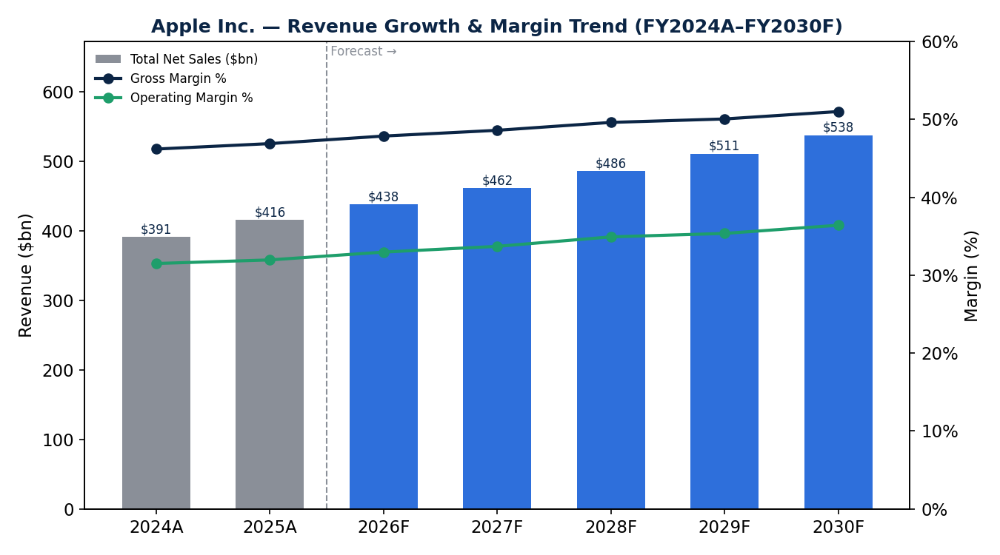
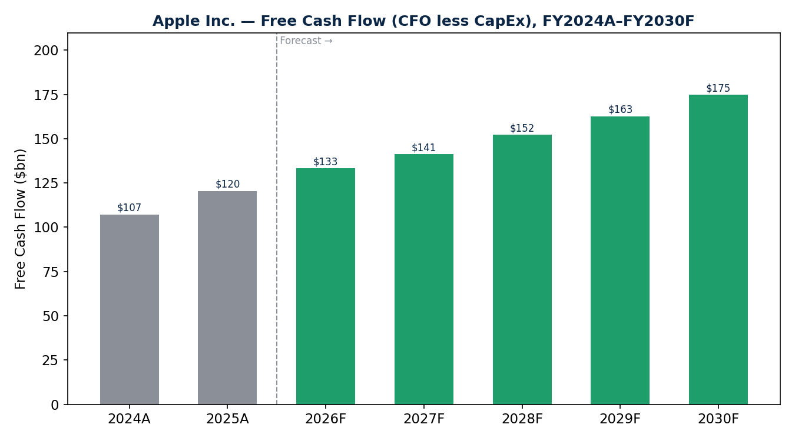
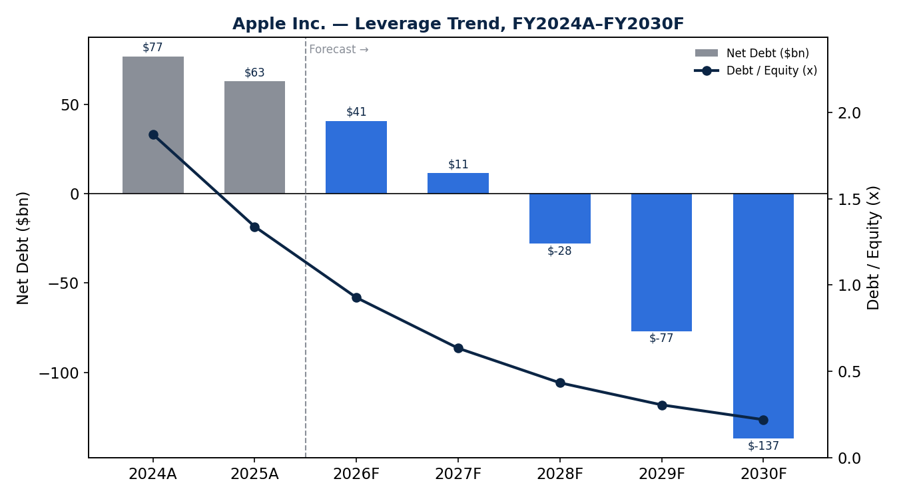

# Apple Inc. (NASDAQ: AAPL) — 3-Statement Financial Model

Prepared by: Facundo Santiago Lezcano
Date: September 2026
Projection Period: 2026E–2030E

- **Source:** Apple Inc. FY2025 Form 10-K, SEC EDGAR (filed October 31, 2025)
  — https://www.sec.gov/Archives/edgar/data/320193/000032019325000079/aapl-20250927.htm
- **Units:** USD in millions unless otherwise stated

## Color Coding

- 🔵 Blue — hardcoded inputs
- ⚫ Black — in-sheet formulas
- 🟢 Green — cross-sheet references

## Key Structural Notes

1. Revenue is modeled by product/service category (iPhone, Mac, iPad,
   Wearables, Services), not a single blended growth rate.
2. Cost of Sales is split between Products and Services (different margin
   profiles), and Opex is split into R&D and SG&A.
3. Apple has not broken out interest expense separately on the income
   statement since FY2021; "Other Income/(Expense), net" is modeled as a
   single assumption (% of revenue) rather than a computed interest
   income/expense schedule.
4. Working capital includes Vendor Non-Trade Receivables (amounts due from
   contract manufacturers), unique to Apple's supply chain.
5. Deferred Revenue is modeled as a liability driven by Services revenue
   (bundled service value recognized over time).
6. Retained Earnings is reduced by both Dividends and Share Repurchases.
7. "Other Non-current Assets" is used as a balancing plug (Total L&E less
   all other modeled assets) — this keeps the Balance Sheet Check at 0. See
   [`docs/methodology.md`](docs/methodology.md) for the limitation this
   implies and two issues it masked during review.

Full build notes: [`docs/methodology.md`](docs/methodology.md)

## Charts

| Revenue & Margin Trend | Free Cash Flow | Leverage Trend |
|---|---|---|
|  |  |  |

## Repo Structure

```
aapl-financial-model/
├── README.md
├── model/
│   └── Lezcano-Facundo-Financial_Modeling__AAPL_final.xlsx
├── assets/
│   ├── revenue-margin-trend.png
│   ├── free-cash-flow.png
│   └── leverage-trend.png
└── docs/
    └── methodology.md
```

## License

MIT — see [`LICENSE`](LICENSE).
